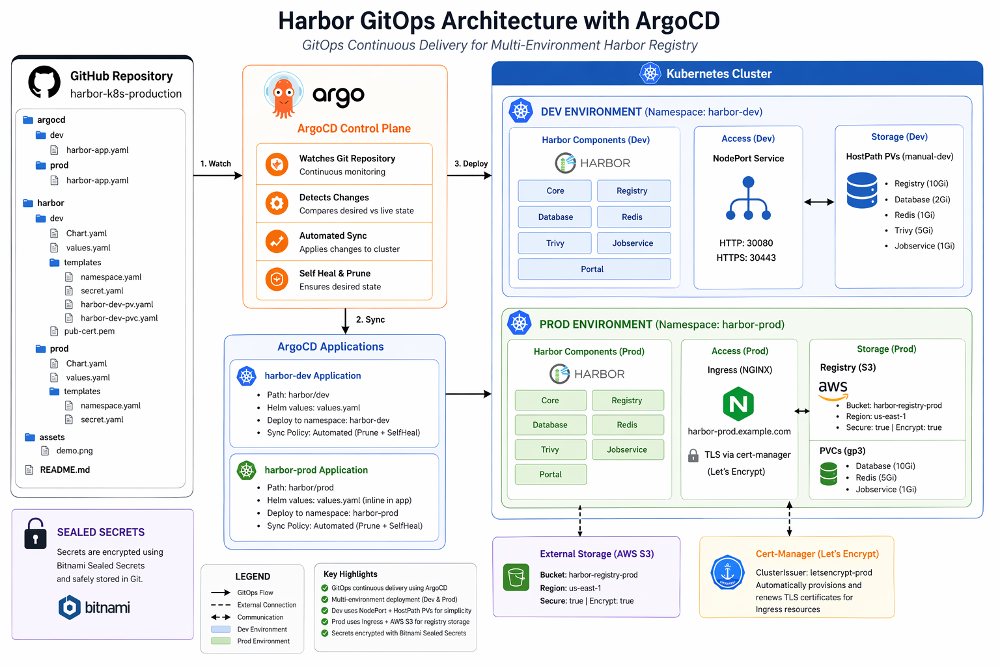
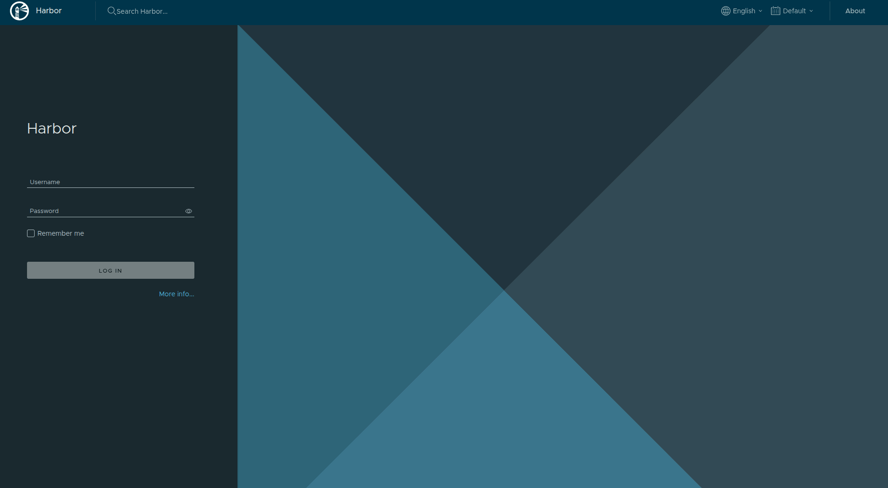

# 🚀 Harbor GitOps on Kubernetes using ArgoCD (Dev + Prod)

This repository demonstrates a **production-grade GitOps setup for deploying Harbor container registry** on Kubernetes using **ArgoCD + Helm + Sealed Secrets**.

It is designed as a **portfolio DevOps/DevSecOps project** showcasing:

* GitOps workflows
* Multi-environment deployments (dev & prod)
* Secure secret management
* Kubernetes storage provisioning
* Helm-based application packaging

---

## 📌 Architecture Overview

This project uses:

* **ArgoCD** → GitOps continuous delivery engine
* **Kubernetes** → Container orchestration
* **Helm** → Package manager for Harbor deployment
* **Bitnami Sealed Secrets** → Secure secret management
* **Harbor** → Private container registry

---

## 🏗️ Architecture Diagram

<p align="center">
  
</p>

---

## ⚙️ ArgoCD GitOps in Action
<p align="center">
  
</p>

---

## 📦 Harbor Registry Demo
<p align="center">
  
</p>

---

### 🔹 Key Components

#### 1. ArgoCD Applications

* `argocd/dev/harbor-app.yaml` → Dev environment deployment
* `argocd/prod/harbor-app.yaml` → Production deployment

#### 2. Harbor Helm Charts

* `harbor/dev` → Dev configuration (NodePort + local storage)
* `harbor/prod` → Production configuration (Ingress + S3 storage)

#### 3. Secrets Management

* Uses **Bitnami Sealed Secrets**
* Admin password stored securely as:

  * `harbor-admin-secret`

#### 4. Storage Strategy

* Dev → HostPath / PVC (manual storage class)
* Prod → AWS S3 for registry + managed PVC for internal services

---

## 🧪 Environments

## 🟢 Development (`harbor-dev`)

Features:

* NodePort exposure
* Self-signed TLS
* Local hostPath storage
* Manual storage class (`manual-dev`)

Access:

```
http://<node-ip>:30080
https://<node-ip>:30443
```

---

## 🔴 Production (`harbor-prod`)

Features:

* Ingress-based access
* TLS via cert-manager
* AWS S3 storage backend
* Secure secrets via SealedSecrets

Domain:

```
https://harbor-prod.example.com
```

---

## 🔐 ⚠️ Important Security Note

> ❗ This repository may contain example secrets for demonstration purposes.

* DO NOT use real credentials
* DO NOT commit real secrets to GitHub
* Always use:

  * Sealed Secrets
  * External Secrets
  * Vault / AWS Secrets Manager

👉 This project is **for learning/demo only**

---

## 🔐 Sealed Secrets Setup

Install controller:

```
kubectl apply -f https://github.com/bitnami-labs/sealed-secrets/releases/latest/download/controller.yaml
```

---

### 🔑 Create secret

```
kubectl create secret generic harbor-admin-secret \
  --from-literal=HARBOR_ADMIN_PASSWORD=YourStrongPassword \
  -n harbor-dev \
  --dry-run=client -o yaml > secret.yaml
```

---

### 🔒 Encrypt using kubeseal

```
kubeseal --format yaml < secret.yaml > sealed-secret.yaml
```

---

### 🔁 Apply sealed secret

```
kubectl apply -f sealed-secret.yaml
```

---

## ☁️ AWS S3 (Production Storage)

Harbor registry is configured to use S3:

```
persistence:
  imageChartStorage:
    type: s3
```

---

### ⚠️ DO NOT hardcode credentials

Instead of this ❌:

```
accesskey: YOUR_KEY
secretkey: YOUR_SECRET
```

Use Kubernetes Secret + SealedSecret ✅

---

## 🔐 Secrets Management

This project uses **Bitnami Sealed Secrets** to encrypt sensitive data.

Example:

```yaml
kind: SealedSecret
metadata:
  name: harbor-admin-secret
```

✔ Secrets are safe to store in Git
✔ Only cluster controller can decrypt

---

## ⚙️ Deployment Flow (GitOps)

1. Developer pushes code to GitHub
2. ArgoCD detects changes
3. Helm chart is rendered
4. Kubernetes applies resources
5. Harbor is automatically updated

---

## 🚀 How to Deploy

### 1. Install ArgoCD

```bash
kubectl create namespace argocd
kubectl apply -n argocd -f https://raw.githubusercontent.com/argoproj/argo-cd/stable/manifests/install.yaml
```

### 2. Apply ArgoCD Applications

```bash
kubectl apply -f argocd/dev/harbor-app.yaml
kubectl apply -f argocd/prod/harbor-app.yaml
```

---

## 📦 Helm Dependency

Harbor is installed via official Helm chart:

```
https://helm.goharbor.io
```

Version used:

```
harbor 1.14.0
```

---

## 🔒 Security Highlights

* Sealed Secrets for Git-safe credentials
* TLS enabled in production
* S3 encryption enabled (prod)
* Namespace isolation (`harbor-dev`, `harbor-prod`)

---

## 📊 DevOps Practices Demonstrated

✔ GitOps (ArgoCD)
✔ Infrastructure as Code (Helm + YAML)
✔ Secure secret handling
✔ Multi-environment strategy
✔ Production-ready storage design
✔ Kubernetes native deployment

---

## 🧠 Skills Showcased

* Kubernetes (K8s)
* ArgoCD GitOps
* Helm Charts
* Harbor Registry
* AWS S3 integration
* DevSecOps practices
* Sealed Secrets

---


## 🔒 Prod TLS Setup (cert-manager)

Install cert-manager:

```
kubectl apply -f https://github.com/cert-manager/cert-manager/releases/latest/download/cert-manager.yaml
```

Use Let’s Encrypt via ClusterIssuer.

---

## 📦 Storage Configuration

### Dev

* hostPath PV
* PVC manually bound

### Prod

* S3 for registry
* EBS for DB/Redis

---

## ⚠️ Common Issues

### PVC Pending

```
kubectl get pvc -A
```

Check StorageClass:

```
kubectl get storageclass
```

---

### Ingress Not Working

* Ensure ingress controller is installed
* Check domain mapping

---

### TLS Not Issued

* Verify DNS points to cluster
* Ensure port 80 is open

---

## 💡 Recommendations

* Use Sealed Secrets instead of plain secrets
* Use S3 for production storage
* Separate dev and prod configurations
* Avoid overcomplicating base configs early
* Keep repo private if possible

---

## ⭐ Support

If you find this project helpful, please give it a star ⭐ on GitHub.

---

## 🌐 Connect With Me

<div align="center">
  
[](https://www.linkedin.com/in/shaikh-muhammad-ajaz)
[](mailto:shaikhajaz38000@gmail.com)
[](https://www.youtube.com/@devopswithajaz)
</div>

<div align="center">

[](https://upwork.com/freelancers/muhammadajaz)
[](https://www.fiverr.com/ajazshaikh3800)
</div>

---

<div align="center">
  
### 💡 "Turning ideas into production-ready systems."


[](https://github.com/Ajaz3800)

</div>