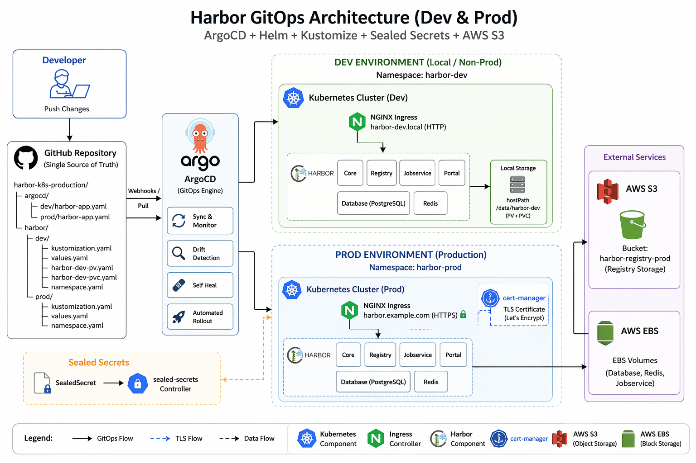

# harbor-k8s-production
Harbor Deploy on k8s with HA for Production
# 🚀 Harbor GitOps Deployment (Dev + Prod) with ArgoCD

This repository demonstrates a **production-style GitOps setup** for deploying Harbor on Kubernetes using:

* ArgoCD (GitOps)
* Helm (Harbor deployment)
* Kustomize (environment separation)
* Sealed Secrets (secure secret handling)
* AWS S3 (production storage backend)

---

## 🧰 Tech Stack

* Kubernetes
* ArgoCD
* Helm
* Kustomize
* Bitnami Sealed Secrets
* AWS S3

---

## 📁 Project Structure

```
harbor-k8s-production/
├── argocd/
│   ├── dev/
│   │   └── harbor-app.yaml
│   └── prod/
│       └── harbor-app.yaml
│
├── harbor/
│   ├── dev/
│   │   ├── kustomization.yaml
│   │   ├── namespace.yaml
│   │   ├── values.yaml
│   │   ├── harbor-dev-pv.yaml
│   │   └── harbor-dev-pvc.yaml
│   │
│   └── prod/
│       ├── kustomization.yaml
│       ├── namespace.yaml
│       └── values.yaml
│
└── README.md
```

---

## 🏗️ Architecture Diagram



---

## 🔐 ⚠️ Important Security Note

> ❗ This repository may contain example secrets for demonstration purposes.

* DO NOT use real credentials
* DO NOT commit real secrets to GitHub
* Always use:

  * Sealed Secrets
  * External Secrets
  * Vault / AWS Secrets Manager

👉 This project is **for learning/demo only**

---

## 🔐 Sealed Secrets Setup

Install controller:

```
kubectl apply -f https://github.com/bitnami-labs/sealed-secrets/releases/latest/download/controller.yaml
```

---

### 🔑 Create secret

```
kubectl create secret generic harbor-admin-secret \
  --from-literal=HARBOR_ADMIN_PASSWORD=YourStrongPassword \
  -n harbor-dev \
  --dry-run=client -o yaml > secret.yaml
```

---

### 🔒 Encrypt using kubeseal

```
kubeseal --format yaml < secret.yaml > sealed-secret.yaml
```

---

### 🔁 Apply sealed secret

```
kubectl apply -f sealed-secret.yaml
```

---

## ☁️ AWS S3 (Production Storage)

Harbor registry is configured to use S3:

```
persistence:
  imageChartStorage:
    type: s3
```

---

### ⚠️ DO NOT hardcode credentials

Instead of this ❌:

```
accesskey: YOUR_KEY
secretkey: YOUR_SECRET
```

Use Kubernetes Secret + SealedSecret ✅

---

## 🚀 Deployment Steps

### 1. Install ArgoCD

```
kubectl create namespace argocd

kubectl apply -n argocd \
  -f https://raw.githubusercontent.com/argoproj/argo-cd/stable/manifests/install.yaml
```

---

### 2. Apply Applications

#### Dev

```
kubectl apply -f argocd/dev/harbor-app.yaml
```

#### Prod

```
kubectl apply -f argocd/prod/harbor-app.yaml
```

---

### 3. Access ArgoCD UI

```
kubectl port-forward svc/argocd-server -n argocd 8080:443
```

Open:

```
https://localhost:8080
```

---

## 🌐 Dev Access (Local)

Update `/etc/hosts`:

```
127.0.0.1 harbor-dev.local
```

Access:

```
http://harbor-dev.local
```

---

## 🔒 Prod TLS Setup (cert-manager)

Install cert-manager:

```
kubectl apply -f https://github.com/cert-manager/cert-manager/releases/latest/download/cert-manager.yaml
```

Use Let’s Encrypt via ClusterIssuer.

---

## 📦 Storage Configuration

### Dev

* hostPath PV
* PVC manually bound

### Prod

* S3 for registry
* EBS for DB/Redis

---

## ⚠️ Common Issues

### PVC Pending

```
kubectl get pvc -A
```

Check StorageClass:

```
kubectl get storageclass
```

---

### Ingress Not Working

* Ensure ingress controller is installed
* Check domain mapping

---

### TLS Not Issued

* Verify DNS points to cluster
* Ensure port 80 is open

---

## 💡 Recommendations

* Use Sealed Secrets instead of plain secrets
* Use S3 for production storage
* Separate dev and prod configurations
* Avoid overcomplicating base configs early
* Keep repo private if possible

---

## 🚀 Future Improvements

* External Secrets Operator
* AWS IAM Roles (IRSA)
* Prometheus + Grafana monitoring
* Harbor Trivy integration
* CI/CD pipeline integration

---

## ⭐ Support

If you find this project helpful, please give it a star ⭐ on GitHub.

---

## 🌐 Connect With Me

<div align="center">
  
[](https://www.linkedin.com/in/shaikh-muhammad-ajaz)
[](mailto:shaikhajaz38000@gmail.com)
[](https://www.youtube.com/@devopswithajaz)
</div>

<div align="center">

[](https://upwork.com/freelancers/muhammadajaz)
[](https://www.fiverr.com/ajazshaikh3800)
</div>

---

<div align="center">
  
### 💡 "Turning ideas into production-ready systems."


[](https://github.com/Ajaz3800)

</div>